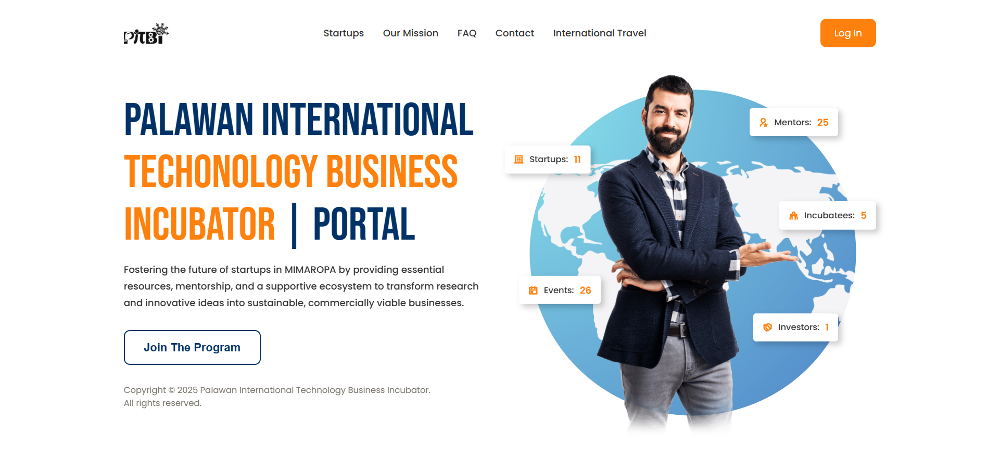
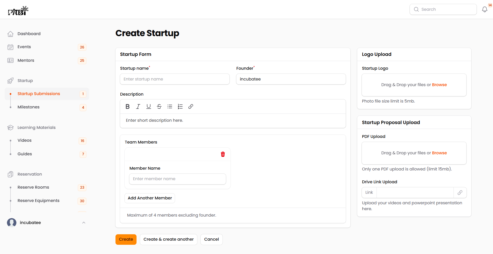
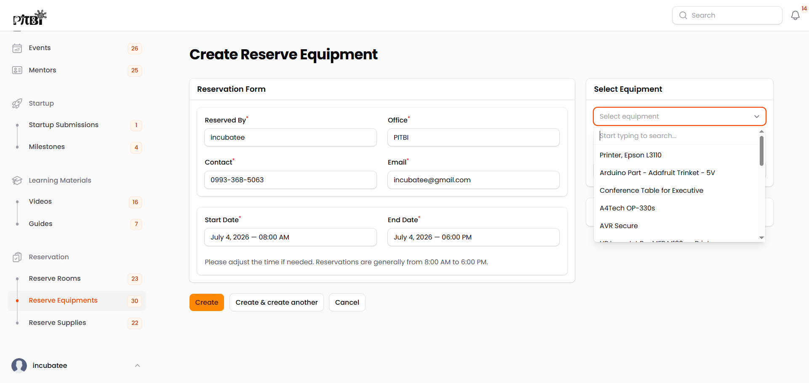
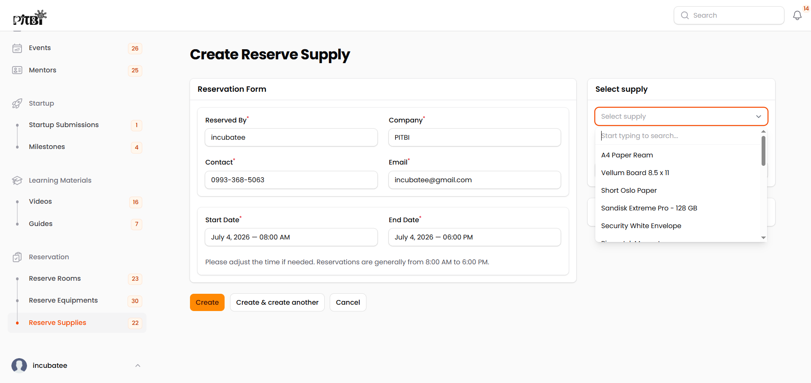
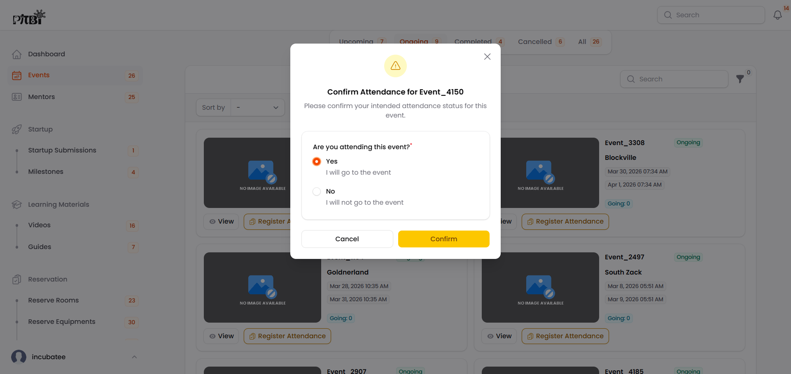
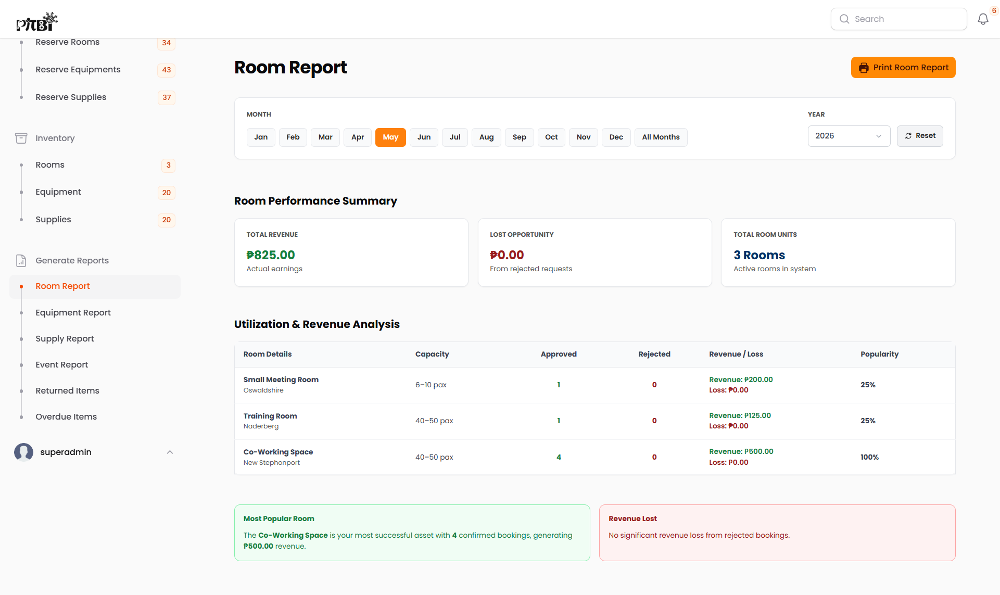
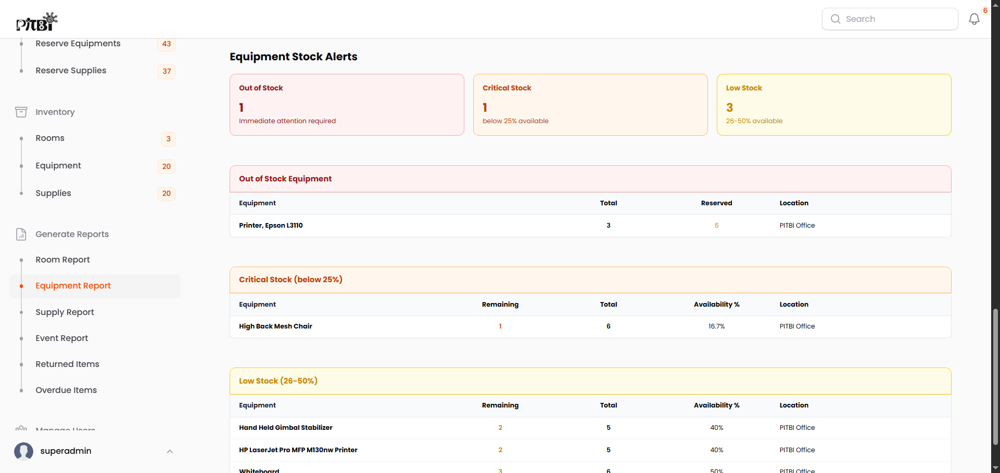
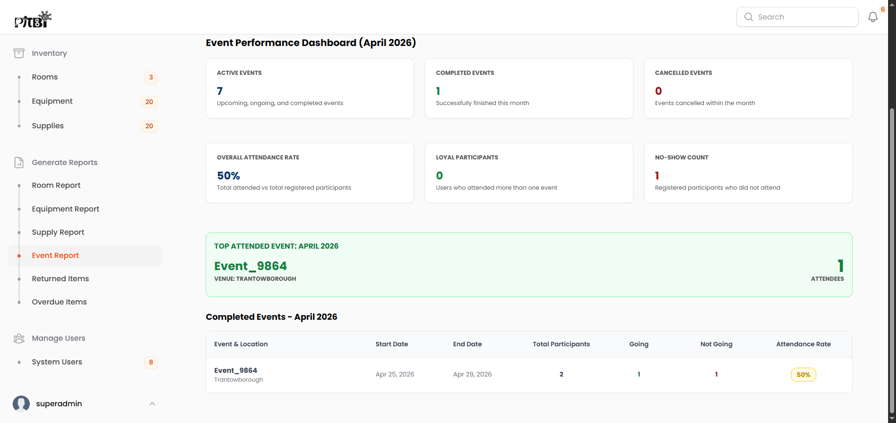
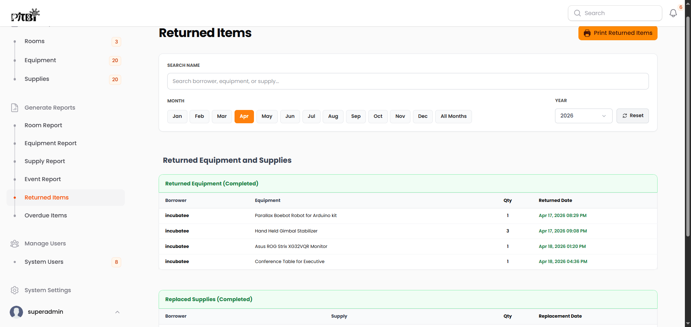
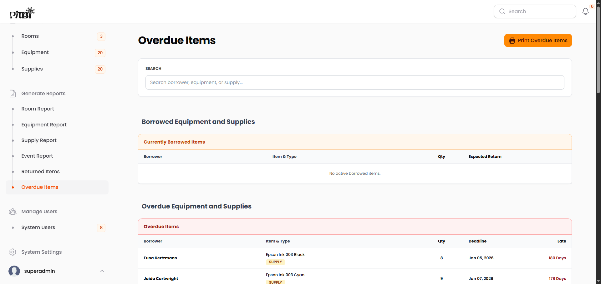

# PITBI Portal

> **An Enterprise-Grade Incubation Management System for Operational Governance, Resource Tracking, and Stakeholder Engagement.**

---

## 📌 Executive Summary

The **PITBI Portal** is a centralized web application engineered to optimize and automate the comprehensive operational lifecycles within an incubation hub. The platform bridges the gap between early-stage business development and resource administration by providing rigorous tracking mechanisms for physical hub assets (real estate facilities, hardware infrastructure, and operational supplies), milestone compliance tracking, data-driven ecosystem event management, and secure stakeholder directories.

Equipped with an analytical reporting subsystem, the system generates monthly and annual auditing metrics regarding asset utilization, financial trends, and programmatic engagement—empowering hub directors with actionable institutional intelligence.

### Platform Interface Preview

---

## 🛠️ Technology Stack & System Core

The application architecture relies on a highly modular backend paired with a rapid administrative interface engine to deliver strict state control, secure access management, and rich user dashboards.

- **Core Framework:** Laravel 12.x
- **Administrative Interface (Dashboard UI):** Filament PHP 4.x (Powering all core administrative, operational, and data views)
- **Access Control Security:** Filament Shield (`bezhansalleh/filament-shield`)
- **Database Engine:** MySQL
- **Document Compilation Engine:** DomPDF for Laravel (`barryvdh/laravel-dompdf`)
- **Data Visualization:** Apex Charts for Filament (`leandrocfe/filament-apex-charts`)
- **Storage Optimization Strategy:** Direct URL redirection to external cloud storage providers (e.g., Google Drive links) for media components and heavy documents, eliminating server-side storage overhead.

---

## 🔐 Access Control & Role-Based Governance

The system enforces a strict, hierarchical **Role-Based Access Control (RBAC)** model managed via Filament Shield. To preserve data integrity and system security, **public self-registration is entirely disabled**. All user accounts are provisioned exclusively through secure administrative assignment.

### 1. Incubatee Role

Incubatees represent the primary programmatic beneficiaries of the incubation hub. Their accessible interface focuses on developmental compliance and resource allocation:

- **Incubation Compliance Workflow:** Submission of startup venture proposals and ongoing progressive tracking of assigned institutional milestone tasks.

    

- **Asset Allocation Requests:** Submission of reservation requests across three isolated inventory domains:
    - **Facilities (Rooms):** Booking management for incubation spaces, meeting rooms, or event halls.
    - **Fixed Assets (Equipment):** Non-consumable physical hardware, devices, or electronic assets.
    - **Consumable Inventories (Supplies):** Essential office consumables.

    |                                     Resource Module Previews                                      |
    | :-----------------------------------------------------------------------------------------------: |
    |         **Room Reservations**            |
    |   **Equipment Requests**       |
    | **Office Supplies Procurement**    |

- **Ecosystem Mentorship Directory:** Read-only access to profiles of vetted industry mentors.
- **Programmatic Engagement:** Portal for viewing upcoming hub events and logging digital attendance states.

    

- **Knowledge Repository:** On-demand access to learning resource records. To optimize system storage, video assets and instructional guides are saved as raw, external hyperlinks pointing directly to resource locations hosted on Google Drive.

### 2. Investor Role

Investors act as external ecosystem stakeholders, permitted restricted read-only access for strategic market scouting:

- **Venture Capital Discovery:** Exclusive directory access to view profiles of **approved startups only**. _Note: Communication, networking, and procurement protocols are handled externally._
- **Event Access:** General access to view public hub events and log digital attendance.

### 3. Admin Role

Administrators maintain the operational equilibrium of the hub, overseeing logistics and user lifecycle touchpoints:

- **Venture Pipeline Management:** Authority to evaluate, approve, or reject incoming startup applications, alongside a task creation engine to enforce startup accountability via specific milestone dependencies.
- **Logistical Queue Management:** Multi-category validation queue to systematically approve or reject reservation requests for facilities, equipment, and supplies.
- **Knowledge Management Systems:** Creation of learning resource indices. Video training content and written documentation are managed by inserting direct external links to Google Drive to keep server storage unburdened.
- **Consultant Profiling:** Production of a public mentor registry detailing professional profiles, expertise domains, and contact indices.
- **Event Lifecycle Control:** Manual operational control over the status of hub events (Create, Start, Cancel, or Complete). _Note: State transitions are executed manually due to localized environment scheduling constraints._
- **Auditing Directory:** Read-only surveillance of user account sheets across the ecosystem (structural modifications, credential alterations, and user deletions are strictly restricted at this tier).

### 4. Superadmin Role

The Superadmin possesses absolute root governance over the system infrastructure, account provisioning, and macro-level analytical aggregation:

- **Global Overrides:** Comprehensive inheritance of all operational capabilities assigned to the standard Admin role.
- **Identity & Access Provisioning:** The exclusive administrative tier authorized to generate, configure, and initialize system credentials and user accounts.
- **Auditing & Analytical Reporting Subsystem:** Advanced compilation engine capable of rendering exhaustive **Monthly and Annual analytical reports with PDF export capability** across six distinct tracking tables:

| Report Subsystem                             | Operational Metrics & Analytical Vectors                                                                                                                                                                                                                                                                                                                                                                                                          |
| :------------------------------------------- | :------------------------------------------------------------------------------------------------------------------------------------------------------------------------------------------------------------------------------------------------------------------------------------------------------------------------------------------------------------------------------------------------------------------------------------------------ |
| 📊 **Facility Metrics (Rooms)**              | Audits financial indicators by tracking generated income alongside computed income deficits derived directly from approved vs. rejected reservation slots.                                                                                                                                                                                                                             |
| 🛠️ **Fixed Asset Auditing (Equipment)**      | Renders comprehensive utilization metrics including total Borrow Frequency alongside real-time availability states (_Available_, _Reserved_, _Unavailable_). Integrates an automated **Stock Level Alert System**:  • ❌ _Out of Stock_ (0% Volume) • ⚠️ _Critical Status_ (< 25% Availability) • 📉 _Low Stock Status_ (26% – 50% Availability)     |
| 📦 **Consumable Logistics (Supplies)**       | Replicates the architectural tracking and alert thresholds of the Fixed Asset module, isolated within a dedicated user interface to optimize visual ergonomics and data separation.                                                                                                                                                                                                                                                               |
| 📅 **Event Analytics**                       | Aggregates data from concluded events to isolate Total Attendance Volume, "Attending" indicators, "Declined" indicators, and overall programmatic Attendance Efficiency Rates.                                                                                                                                                                                             |
| 🔄 **Inventory Reconciliation (Returned)**   | A ledger tracking the successful termination of asset distributions. Logs structural data including Borrower Identity, Asset Specifications, Transacted Quantity, and exact Timestamp of Return.                                                                                                                                                                        |
| ⚠️ **Risk & Delinquency Tracking (Overdue)** | Monitors unreturned assets and active, non-concluded transactions outside the inventory pool. Isolates the Borrower's Identity, Item Class/Type, Quantity, Agreed Deadline, and an **Incremental Latency Counter** (e.g., _89 Days Past Maturity_). This matrix also renders active borrowed resources currently waiting for return.                  |
