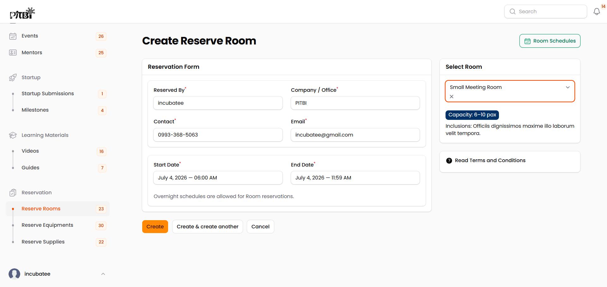
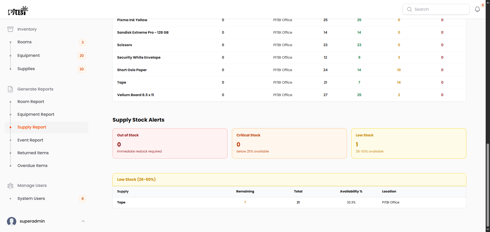

# PITBI Portal: A Management System for Operations, Tracking, and Engagement

> **An incubation management system for tracking hub resources, monitoring startup progress, and coordinating stakeholders.**

---

## 📌 Overview

**PITBI Portal** is a web application built to manage the day-to-day operations of an incubation hub. It centralizes the tracking of physical resources (rooms, equipment, and supplies), monitors startup milestone progress, organizes hub events, and maintains directories for mentors, startups, and investors.

The system also includes a reporting module that compiles monthly and annual data on resource usage, financial performance, and event participation, giving hub administrators a clear view of how the program is running.

### Platform Interface Preview

---

## 🛠️ Technology Stack

- **Core Framework:** Laravel 12.x
- **Admin Dashboard UI:** Filament PHP 4.x (used for all administrative and operational views)
- **Access Control:** Filament Shield (`bezhansalleh/filament-shield`)
- **Database:** MySQL
- **PDF Generation:** DomPDF for Laravel (`barryvdh/laravel-dompdf`)
- **Data Visualization:** Apex Charts for Filament (`leandrocfe/filament-apex-charts`)
- **Storage Approach:** Media and large files are linked externally (e.g., Google Drive) rather than stored on the server, keeping storage costs down.

---

## 🔐 Access Control & User Roles

Access is managed through a role-based system using Filament Shield. Public registration is disabled — all accounts are created by an administrator.

### 1. Incubatee

Incubatees are the startups going through the incubation program. Their access is focused on submitting progress and requesting resources:

- **Startup Compliance:** Submit venture proposals and track progress on assigned milestones.

    

- **Resource Requests:** Submit reservation requests across three categories:
    - **Facilities (Rooms):** Incubation spaces, meeting rooms, or event halls.
    - **Fixed Assets (Equipment):** Reusable hardware and devices.
    - **Consumables (Supplies):** Office supplies and consumable materials.

    |                                     Resource Module Previews                                      |
    | :-----------------------------------------------------------------------------------------------: |
    |         **Room Reservations**            |
    |   **Equipment Requests**       |
    | **Office Supplies Procurement**    |

- **Mentor Directory:** View profiles of available industry mentors.
- **Event Participation:** View upcoming hub events and confirm attendance.

    

- **Knowledge Repository:** Access learning materials. Videos and guides are stored as external links (Google Drive) rather than uploaded directly.

### 2. Investor

Investors are external stakeholders with limited, read-only access for sourcing opportunities:

- **Startup Directory:** View profiles of **approved startups only**. Communication and deal-making happen outside the platform.
- **Event Access:** View public hub events and confirm attendance.

### 3. Admin

Admins handle the daily operations of the hub:

- **Startup Pipeline:** Review, approve, or reject startup applications, and assign milestone tasks to track their progress.
- **Reservation Approvals:** Review and approve or reject reservation requests for rooms, equipment, and supplies.
- **Knowledge Management:** Add learning resources by linking external videos and documents.
- **Mentor Directory Management:** Maintain the public mentor registry, including profiles, expertise, and contact details.
- **Event Management:** Create, start, cancel, or complete hub events. _Note: Event status changes are done manually since the system doesn't run on a hosted scheduler._
- **User Auditing:** View user account activity (read-only — account edits, credential changes, and deletions are restricted to Superadmins).

### 4. Superadmin

Superadmins have full control over the system, including account provisioning and reporting:

- **Full Admin Access:** Inherits all Admin capabilities.
- **Account Provisioning:** The only role that can create and configure new user accounts.
- **Reporting Module:** Generates monthly and annual reports, exportable as PDF, across six categories:

| Report                  | What It Covers                                                                                                                                                                                                                                                                                                                                          |
| :---------------------- | :------------------------------------------------------------------------------------------------------------------------------------------------------------------------------------------------------------------------------------------------------------------------------------------------------------------------------------------------------ |
| 📊 **Room Report**      | Tracks income earned from approved room reservations, and income lost from rejected ones.                                                                                                                                                                                                    |
| 🛠️ **Equipment Report** | Shows how often each item is borrowed and its current availability (_Available_, _Reserved_, _Unavailable_), with automatic stock alerts: • ❌ _Out of Stock_ (0% remaining) • ⚠️ _Critical_ (under 25% remaining) • 📉 _Low Stock_ (26–50% remaining)     |
| 📦 **Supply Report**    | Uses the same tracking and stock alert system as the Equipment Report, shown in its own dedicated view for supplies.                                                                                                                                              |
| 📅 **Event Report**     | Summarizes attendance for completed events — total attendees, "Attending" vs. "Declined" counts, and overall attendance rate.                                                                                                                                                    |
| 🔄 **Returned Items**   | Logs completed returns, including who borrowed the item, what it was, how many, and when it was returned.                                                                                                                                                                     |
| ⚠️ **Overdue Items**    | Tracks items that haven't been returned on time, showing the borrower, item, quantity, due date, and days overdue.                                                                                                                                          |
